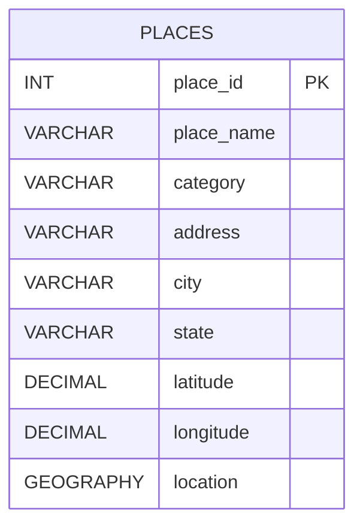

# DatabaseProject

This project contains a PostgreSQL and PostGIS GIS assignment. It sets up a `gis_database` database, enables PostGIS, creates a `places` table, loads sample U.S. locations, demonstrates spatial queries, and includes a standalone 3D satellite map viewer for the stored places.

## Files

- `gis_database_first_part.sql`: Main runnable SQL script.
- `gis_database_first_part.txt`: Plain text copy of the SQL deliverable.
- `gis_database_first_part_submission.pdf`: PDF submission document.
- `gis_database_first_part_submission.md`: Markdown source used for the PDF.
- `places_table_diagram.md`: Standalone table diagrams in ASCII and Mermaid formats.
- `map_viewer.html`: Standalone 3D satellite map interface.
- `map_viewer.css`: Styling for the map interface.
- `map_viewer.js`: Map logic for coordinates, km distance, and nearby search.
- `map_config.js`: Mapbox configuration file for the access token and style.
- `places_data.js`: GeoJSON-style client-side place data matching the sample records.

## What The SQL Does

The SQL script includes these sections:

1. Creates a PostgreSQL database named `gis_database`.
2. Enables the `postgis` extension.
3. Creates a `places` table with descriptive columns and a `GEOGRAPHY(POINT, 4326)` location column.
4. Inserts five realistic locations from the United States.
5. Lists all records in the table.
6. Calculates the distance between two places with `ST_Distance` and displays the result in kilometers.
7. Finds places within `5` kilometers of a reference place with `ST_DWithin`.
8. Exports the database rows as GeoJSON for mapping.

## Table Structure

| Column | Type | Notes |
| --- | --- | --- |
| `place_id` | `INTEGER` | Primary key, identity column |
| `place_name` | `VARCHAR(150)` | Place name |
| `category` | `VARCHAR(100)` | Type of place |
| `address` | `VARCHAR(200)` | Street address or site address |
| `city` | `VARCHAR(100)` | City name |
| `state` | `VARCHAR(50)` | State abbreviation or name |
| `latitude` | `DECIMAL(9, 6)` | Decimal latitude |
| `longitude` | `DECIMAL(9, 6)` | Decimal longitude |
| `location` | `GEOGRAPHY(POINT, 4326)` | Spatial point for PostGIS queries |

## Diagram



## How To Run The SQL

Run the database creation statement first from PostgreSQL:

```sql
CREATE DATABASE gis_database;
```

Then connect to the database and run the rest of the script:

```sql
\c gis_database
CREATE EXTENSION IF NOT EXISTS postgis;
```

After connecting, execute the contents of `gis_database_first_part.sql`.

## Important PostGIS Notes

- `ST_MakePoint` must receive coordinates in this order: `longitude, latitude`.
- The `location` column uses `SRID 4326`, which matches standard GPS latitude and longitude coordinates.
- `ST_Distance` on `GEOGRAPHY` values returns meters, so the example queries divide by `1000` and display kilometers.
- `ST_DWithin` still expects the search radius in meters, so `5000` means `5` kilometers.

## Sample Spatial Queries Included

Distance between two places in kilometers:

```sql
SELECT
    p1.place_name AS from_place,
    p2.place_name AS to_place,
    ROUND((ST_Distance(p1.location, p2.location) / 1000.0)::NUMERIC, 2) AS distance_km
FROM places AS p1
CROSS JOIN places AS p2
WHERE p1.place_name = 'Statue of Liberty'
  AND p2.place_name = 'Willis Tower';
```

Nearby search within `5` kilometers:

```sql
SELECT
    p2.place_id,
    p2.place_name,
    p2.category,
    p2.city,
    p2.state,
    ROUND((ST_Distance(p1.location, p2.location) / 1000.0)::NUMERIC, 2) AS distance_km
FROM places AS p1
JOIN places AS p2
    ON p1.place_id <> p2.place_id
WHERE p1.place_name = 'Griffith Observatory'
  AND ST_DWithin(p1.location, p2.location, 5000)
ORDER BY distance_km;
```

## 3D Satellite Map Viewer

The repo now includes a standalone browser-based map interface in `map_viewer.html`.

It supports:

- Satellite basemap with 3D terrain and building extrusion.
- Exact latitude and longitude display for every point in the database.
- Direct point-to-point distance measurement in kilometers.
- Nearby-place filtering in kilometers.
- An on-map view that behaves like a lightweight GIS/Google Maps style place viewer.

## Map Setup

The map viewer uses Mapbox GL JS for satellite imagery and 3D rendering.

1. Open `map_config.js`.
2. Replace `PASTE_MAPBOX_ACCESS_TOKEN_HERE` with a valid Mapbox access token.
3. Open `map_viewer.html` in a browser.

Without a valid token, the controls still load but the 3D satellite map will not render.

## Map Data Source

The browser map uses `places_data.js`, which mirrors the sample records in the SQL insert statements. If you want to connect it to live database output later, use the GeoJSON export query included in `gis_database_first_part.sql` and replace the client-side data source with API output or generated GeoJSON.
