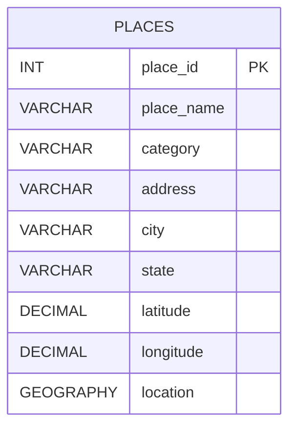

# DatabaseProject

This repository now contains both the original PostgreSQL/PostGIS coursework deliverables and a Dockerized Flask app that works against the same `gis_database` database. The `map` branch merges the newer application code from `main` with the mapping changes already built earlier: nearby results are displayed in kilometers, and the nearby page now includes a 3D satellite map with exact coordinates and point-to-point distance display.

## Main Project Areas

- `gis_database_first_part.sql`: SQL setup for the original assignment deliverable.
- `gis_database_first_part.txt`: Plain text copy of the assignment SQL.
- `gis_database_first_part_submission.md`: Submission write-up source.
- `gis_database_first_part_submission.pdf`: Submission PDF.
- `app.py`: Main Flask application.
- `templates/`: Root Flask templates.
- `gis_pull_app/gis_pull_app/`: Secondary copy of the Flask app and templates.
- `compose.yaml`: Docker Compose setup for PostGIS and the Flask app.

## What Changed On `map`

- The nearby search now accepts kilometers in the UI.
- The backend still uses `ST_DWithin(..., meters)` correctly by converting km to meters before querying PostGIS.
- Search results now display `distance_km`.
- The `/nearby` page now renders a 3D satellite map with Mapbox GL JS.
- Every place point can show its exact latitude and longitude in a popup.
- The page includes a direct two-point distance comparison similar to a lightweight Google Maps distance view.

## Run With Docker

Start the stack:

```bash
docker compose up --build
```

Open the app:

```text
http://localhost:5001
```

Stop the app:

```bash
docker compose down
```

## Optional 3D Map Setup

The 3D satellite map requires a Mapbox token.

Set it in your shell before starting Docker:

```bash
export MAPBOX_ACCESS_TOKEN=your_mapbox_token_here
docker compose up --build
```

The token is passed into the Flask container through `compose.yaml`. If it is missing, the nearby page still loads, but the 3D satellite layer will not render.

## Data Import Commands

Import OpenStreetMap places / POIs:

```bash
docker compose exec web python import_osm.py
```

Import U.S. Census counties:

```bash
docker compose exec web python import_census_counties.py
```

Import FEMA risk data:

```bash
docker compose exec web python import_fema_risk.py
docker compose exec web python import_fema_county_risk.py
```

Import U.S. cities:

```bash
docker compose exec web python import_us_cities.py
```

## Tests

Run the unit tests:

```bash
python -m unittest discover -s tests
```

If you want the Flask route tests to run too, run them in an environment with the project requirements installed, such as the web container:

```bash
docker compose exec web python -m unittest discover -s tests
```

## App Routes

- `/`: Main GIS database front end.
- `/nearby`: Nearby search in kilometers with the 3D satellite map.
- `/gis_data`: Imported GIS tables and joined GIS outputs.

## Original SQL Notes

- `ST_MakePoint` must use `longitude, latitude`.
- `GEOGRAPHY(POINT, 4326)` is used for Earth-based spatial distance calculations.
- `ST_Distance` on `GEOGRAPHY` returns meters, so the assignment queries divide by `1000` to show kilometers.
- `ST_DWithin` still expects meters, so `5000` equals `5 km`.

## Diagrams



## data import
## might have to do this first
docker compose exec web python download_county_data.py
docker compose exec web python import_census_counties.py 
