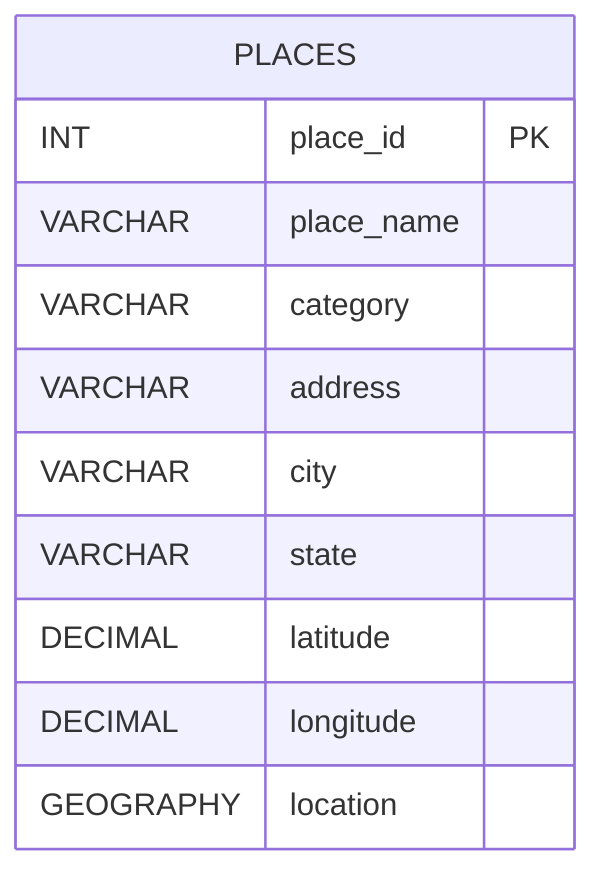

# DatabaseProject

This project contains the first part of a PostgreSQL and PostGIS GIS database assignment. It sets up a `gis_database` database, enables PostGIS, creates a `places` table, loads sample U.S. locations, and demonstrates spatial queries for distance and nearby-place searches.

## Files

- `gis_database_first_part.sql`: Main runnable SQL script.
- `gis_database_first_part.txt`: Plain text copy of the SQL deliverable.
- `gis_database_first_part_submission.pdf`: PDF submission document.
- `gis_database_first_part_submission.md`: Markdown source used for the PDF.
- `places_table_diagram.md`: Standalone table diagrams in ASCII and Mermaid formats.

## What The SQL Does

The SQL script includes these sections:

1. Creates a PostgreSQL database named `gis_database`.
2. Enables the `postgis` extension.
3. Creates a `places` table with descriptive columns and a `GEOGRAPHY(POINT, 4326)` location column.
4. Inserts five realistic locations from the United States.
5. Lists all records in the table.
6. Calculates the distance between two places with `ST_Distance`.
7. Finds places within `5000` meters of a reference place with `ST_DWithin`.

## Table Structure

| Column | Type | Notes |
| --- | --- | --- |
| `place_id` | `INTEGER` | Primary key, identity column |
| `place_name` | `VARCHAR(150)` | Place name |
| `category` | `VARCHAR(100)` | Type of place |
| `address` | `VARCHAR(200)` | Street address or site address |
| `city` | `VARCHAR(100)` | City name |
| `state` | `VARCHAR(50)` | State abbreviation or name |
| `latitude` | `DECIMAL(9, 6)` | Decimal latitude |
| `longitude` | `DECIMAL(9, 6)` | Decimal longitude |
| `location` | `GEOGRAPHY(POINT, 4326)` | Spatial point for PostGIS queries |

## Diagram



## How To Run

Run the database creation statement first from PostgreSQL:

```sql
CREATE DATABASE gis_database;
```

Then connect to the database and run the rest of the script:

```sql
\c gis_database
CREATE EXTENSION IF NOT EXISTS postgis;
```

After connecting, execute the contents of `gis_database_first_part.sql`.

## Important PostGIS Notes

- `ST_MakePoint` must receive coordinates in this order: `longitude, latitude`.
- The `location` column uses `SRID 4326`, which matches standard GPS latitude and longitude coordinates.
- `ST_Distance` on `GEOGRAPHY` values returns distance in meters.
- `ST_DWithin` checks whether locations fall within a given distance in meters.

## Sample Spatial Queries Included

Distance between two places:

```sql
SELECT
    p1.place_name AS from_place,
    p2.place_name AS to_place,
    ROUND(ST_Distance(p1.location, p2.location)) AS distance_meters
FROM places AS p1
CROSS JOIN places AS p2
WHERE p1.place_name = 'Statue of Liberty'
  AND p2.place_name = 'Willis Tower';
```

Nearby search within `5000` meters:

```sql
SELECT
    p2.place_id,
    p2.place_name,
    p2.category,
    p2.city,
    p2.state,
    ROUND(ST_Distance(p1.location, p2.location)) AS distance_meters
FROM places AS p1
JOIN places AS p2
    ON p1.place_id <> p2.place_id
WHERE p1.place_name = 'Griffith Observatory'
  AND ST_DWithin(p1.location, p2.location, 5000)
ORDER BY distance_meters;
```


docker compose up --build

http://localhost:5000

Import OpenStreetMap (places / POIs)

docker compose exec web python import_osm.py

Import U.S. Census Counties (boundaries)

docker compose exec web python import_census_counties.py

Import FEMA Risk Data (state-level)

data/NRI_Table_States.csv

docker compose exec web python import_fema_risk.py

Step 4: View GIS Data

http://localhost:5000/gis_data

Stop the app

docker compose down
