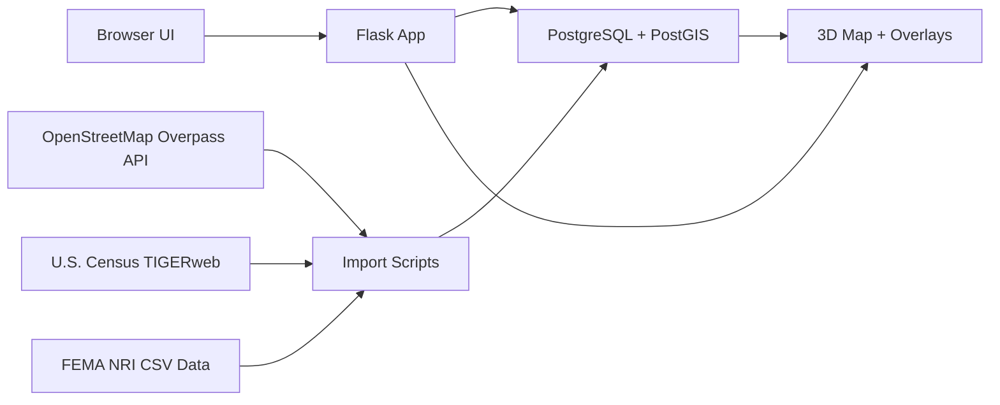
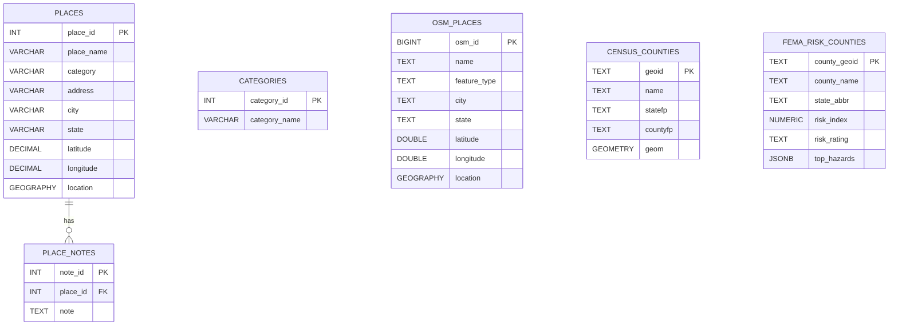

# GeoRisk Explorer

A full-stack GIS database application that turns PostgreSQL/PostGIS data into an interactive risk and place intelligence dashboard. The project combines custom place records, OpenStreetMap points of interest, U.S. Census county boundaries, and FEMA National Risk Index data so users can search nearby locations, visualize geographic risk, and inspect spatial relationships on a 3D map.

## Project Highlights

- Built a Dockerized Flask + PostgreSQL/PostGIS application with reproducible local setup.
- Modeled real-world places with `GEOGRAPHY(POINT, 4326)` for accurate Earth-distance calculations.
- Implemented nearby search with `ST_DWithin` and `ST_Distance`, returning results in kilometers.
- Imported external GIS datasets from OpenStreetMap, U.S. Census TIGERweb, and FEMA National Risk Index CSVs.
- Joined point data to county polygons with `ST_Within` to connect places with county and state risk scores.
- Rendered an interactive Mapbox-powered 3D satellite map with point search, filters, popups, county overlays, and distance comparison.
- Added unit tests for geospatial helper logic and Flask route behavior.

## Tech Stack

| Layer | Tools |
| --- | --- |
| Backend | Python, Flask |
| Database | PostgreSQL, PostGIS |
| Frontend | Jinja templates, HTML, CSS, JavaScript, Mapbox GL JS |
| Data Sources | OpenStreetMap Overpass API, U.S. Census TIGERweb, FEMA National Risk Index |
| Infrastructure | Docker, Docker Compose |
| Testing | Python `unittest`, route mocks |

## What The App Does

The application provides three main workflows:

1. **Manage location records**
   - Add categories, places, and notes through the Flask interface.
   - Store latitude/longitude as both raw coordinates and PostGIS geography points.

2. **Analyze nearby places**
   - Select a center location and radius in kilometers.
   - Query nearby places using PostGIS distance functions.
   - Review distance-ranked results and inspect exact coordinates.

3. **Explore geographic risk**
   - Load county geometries from Census TIGERweb.
   - Import FEMA state and county risk scores.
   - Display risk overlays and top county hazard drivers on the map.
   - Join stored places to their containing counties for contextual risk reporting.

## Architecture


```mermaid
flowchart LR
    User["Browser UI"] --> Flask["Flask App"]
    Flask --> PostGIS["PostgreSQL + PostGIS"]
    Importers["Import Scripts"] --> PostGIS
    OSM["OpenStreetMap Overpass API"] --> Importers
    Census["U.S. Census TIGERweb"] --> Importers
    FEMA["FEMA NRI CSV Data"] --> Importers
    PostGIS --> Mapbox["3D Map + Overlays"]
    Flask --> Mapbox
```

## Core Data Model


```mermaid
erDiagram
    PLACES {
        INT place_id PK
        VARCHAR place_name
        VARCHAR category
        VARCHAR address
        VARCHAR city
        VARCHAR state
        DECIMAL latitude
        DECIMAL longitude
        GEOGRAPHY location
    }

    CATEGORIES {
        INT category_id PK
        VARCHAR category_name
    }

    PLACE_NOTES {
        INT note_id PK
        INT place_id FK
        TEXT note
    }

    OSM_PLACES {
        BIGINT osm_id PK
        TEXT name
        TEXT feature_type
        TEXT city
        TEXT state
        DOUBLE latitude
        DOUBLE longitude
        GEOGRAPHY location
    }

    CENSUS_COUNTIES {
        TEXT geoid PK
        TEXT name
        TEXT statefp
        TEXT countyfp
        GEOMETRY geom
    }

    FEMA_RISK_COUNTIES {
        TEXT county_geoid PK
        TEXT county_name
        TEXT state_abbr
        NUMERIC risk_index
        TEXT risk_rating
        JSONB top_hazards
    }

    PLACES ||--o{ PLACE_NOTES : has
```

## Spatial Queries Worth Noticing

The project uses PostGIS for production-style geospatial operations rather than calculating everything in application code.

Nearby search:

```sql
SELECT
    p2.place_id,
    p2.place_name,
    p2.category,
    ROUND((ST_Distance(p1.location, p2.location) / 1000.0)::NUMERIC, 2) AS distance_km
FROM places AS p1
JOIN places AS p2
    ON p1.place_id <> p2.place_id
WHERE p1.place_id = %s
  AND ST_DWithin(p1.location, p2.location, %s)
ORDER BY distance_km;
```

Place-to-county risk join:

```sql
SELECT
    p.place_name,
    c.name AS county_name,
    frc.risk_index,
    frc.risk_rating
FROM places p
LEFT JOIN census_counties c
  ON ST_Within(p.location::geometry, c.geom)
LEFT JOIN fema_risk_counties frc
  ON c.geoid = REPLACE(frc.county_geoid, 'C', '');
```

## Getting Started

### Prerequisites

- Docker and Docker Compose
- Optional: a Mapbox access token for the 3D satellite map

### Run The App

```bash
docker compose up --build
```

Open:

```text
http://localhost:5001
```

Stop the stack:

```bash
docker compose down
```

### Enable The 3D Map

The app works without a Mapbox token, but the satellite map requires one.

```bash
export MAPBOX_ACCESS_TOKEN=your_mapbox_token_here
docker compose up --build
```

## Data Imports

The database starts with a small set of seeded landmark records from `init.sql`. Additional import scripts enrich the app with external GIS data.

Run all importers:

```bash
docker compose exec web python import_all.py
```

Or run them individually:

```bash
docker compose exec web python import_osm.py
docker compose exec web python import_osm_parks.py
docker compose exec web python import_osm_restaurants.py
docker compose exec web python import_osm_schools.py
docker compose exec web python import_census_counties.py
docker compose exec web python import_fema_risk.py
docker compose exec web python import_fema_county_risk.py
docker compose exec web python import_us_cities.py
```

If the county FEMA CSV needs to be refreshed:

```bash
docker compose exec web python download_county_data.py
docker compose exec web python import_fema_county_risk.py
```

## Testing

Run the unit test suite locally after installing the project requirements:

```bash
python3 -m unittest discover -s tests
```

When running inside Docker:

```bash
docker compose exec web python -m unittest discover -s tests
```

The tests cover:

- FIPS-to-state conversion
- map filter classification
- risk bucket and risk color logic
- GeoJSON feature shaping
- nearby route rendering
- kilometer-to-meter conversion before `ST_DWithin`

## Repository Tour

| Path | Purpose |
| --- | --- |
| `app.py` | Main Flask application and database-backed routes |
| `geo_features.py` | Geospatial formatting, risk bucketing, map filter helpers |
| `templates/` | Flask pages for the dashboard, nearby map, and imported GIS data |
| `init.sql` | PostGIS extension setup and starter place records |
| `import_*.py` | Data ingestion scripts for OSM, Census, FEMA, and U.S. city data |
| `data/` | Local CSV datasets used by the importers |
| `tests/` | Unit tests for app routes and geospatial helper functions |
| `compose.yaml` | Local PostGIS and Flask orchestration |
| `Dockerfile` | Flask container definition |
| `gis_database_first_part.*` | Original database coursework deliverables |

## API Routes

| Route | Description |
| --- | --- |
| `/` | Main database interface for places, categories, notes, and summary counts |
| `/nearby` | Nearby search, layer filters, direct distance comparison, and 3D map |
| `/gis_data` | Imported OSM, Census, FEMA, and joined place-risk views |
| `/add_place` | Form endpoint for adding a new geocoded place |
| `/add_category` | Form endpoint for adding a category |
| `/add_note` | Form endpoint for attaching notes to places |
