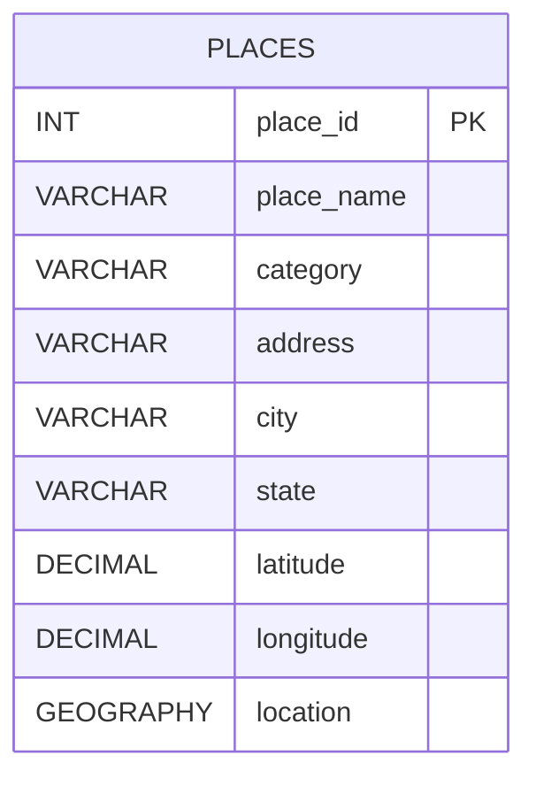

# Places Table Diagram

## ASCII Diagram

```text
+---------------------------------------------------------------+
|                           places                              |
+---------------------------------------------------------------+
| PK  place_id      : INTEGER GENERATED ALWAYS AS IDENTITY      |
|     place_name    : VARCHAR(150)                              |
|     category      : VARCHAR(100)                              |
|     address       : VARCHAR(200)                              |
|     city          : VARCHAR(100)                              |
|     state         : VARCHAR(50)                               |
|     latitude      : DECIMAL(9, 6)                             |
|     longitude     : DECIMAL(9, 6)                             |
|     location      : GEOGRAPHY(POINT, 4326)                    |
+---------------------------------------------------------------+
```

## Mermaid Diagram


